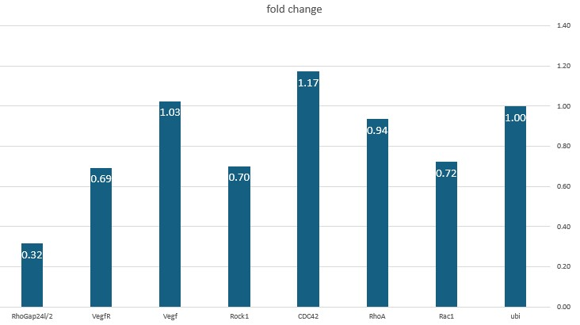

### Delta-Delta Ct Method Description

The Delta-Delta Ct (ΔΔCt) method, also known as the 2^(-ΔΔCt) method, is a quantitative PCR (qPCR) data analysis approach used to determine the relative expression levels of a target gene in different samples. The method involves comparing the Ct (cycle threshold) values of the target gene to a reference gene (housekeeping gene) to normalize for differences in RNA quantity and quality across samples.

#### Steps of the Delta-Delta Ct Method:

1. **Determine the Ct values**:
   - Measure the Ct values of the target gene and the reference gene in both the experimental and control samples.

2. **Calculate the Delta Ct (ΔCt)**:
   - For each sample, subtract the Ct value of the reference gene from the Ct value of the target gene.
     
     ΔCt = Ct_target - Ct_reference

3. **Calculate the Delta-Delta Ct (ΔΔCt)**:
   - Subtract the ΔCt of the control sample from the ΔCt of the experimental sample.
     
     ΔΔCt = ΔCt_experimental - ΔCt_control

4. **Calculate the fold change**:
   - Use the ΔΔCt value to determine the relative fold change in gene expression.
     Fold change = 1.9^-ΔΔCt

### Calculations Based on Provided Data

Given the data from the class work
here are the calculations for the fold changes:
#### Example Calculation for Rac1:

1. **Determine the Ct values**: 

    ### Ct table

|                    | ubi  | Rac1 | RhoA | CDC42 | Rock1 | Vegf | VegfR | RhoGap24l/2 |
|--------------------|------|------|------|-------|-------|------|-------|-------------|
| **DMSO Control**   | 20.72| 25.65| 29.13| 28.45 | 28.28 | 29.71| 28.61 | 29.48        |
| **Inhibitor treatment** | 19.89| 25.34| 28.41| 27.38 | 28.01 | 28.85| 28.36 | 30.45        |

2. **Calculate the ΔCt**:
ΔCt = Ct_target - Ct_reference(ubi)

- ΔCD_Control =  25.65 - 20.72 = 4.94
- ΔCD_treatment = 25.34 - 19.89 = 5.44

   ### ΔCD
|                    | ubi  | Rac1 | RhoA | CDC42 | Rock1 | Vegf | VegfR | RhoGap24l/2 |
|--------------------|------|------|------|-------|-------|------|-------|-------------|
| **DMSO Control**   | 0.00 | 4.94 | 8.41 | 7.73  | 7.56  | 8.99 | 7.90  | 8.76         |
| **Inhibitor treatment** | 0.00 | 5.44 | 8.51 | 7.48  | 8.11  | 8.95 | 8.47  | 10.56        |

3. **Calculate the ΔΔCt**:
ΔΔCt = ΔCt_experimental - ΔCt_control

- ΔΔCt = 5.44 - 4.94 = 0.51

    ### ΔΔCt
|      | ubi  | Rac1 | RhoA | CDC42 | Rock1 | Vegf | VegfR | RhoGap24l/2 |
|------|------|------|------|-------|-------|------|-------|-------------|
|  | 0.00 | 0.51 | 0.10 | -0.25 | 0.55 | -0.04 | 0.57 | 1.79          |
  

4. **Calculate the fold change**:
   Fold change = 1.9^-ΔΔCt

- Fold change = 1.9^(-0.51) = 0.72

    ### fold change
|            | ubi  | Rac1 | RhoA | CDC42 | Rock1 | Vegf | VegfR | RhoGap24l/2 |
|------------|------|------|------|-------|-------|------|-------|-------------|
| fold change| 1.00 | 0.72 | 0.94 | 1.17  | 0.70  | 1.03 | 0.69  | 0.32          |

#### Graph summary of Calculated Fold Changes

