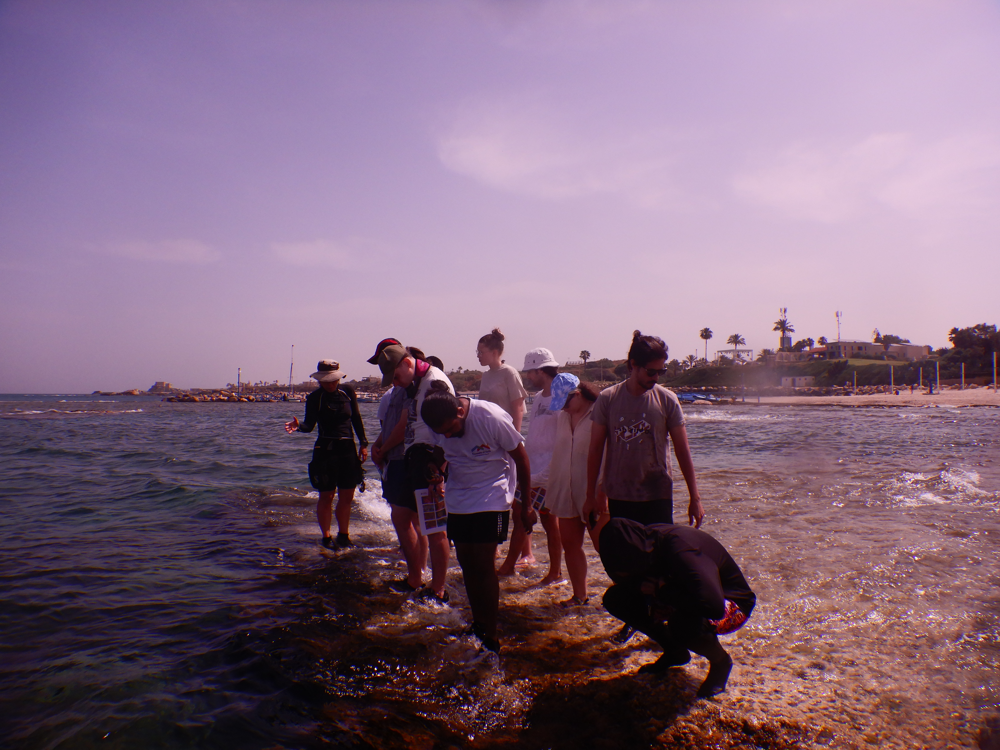
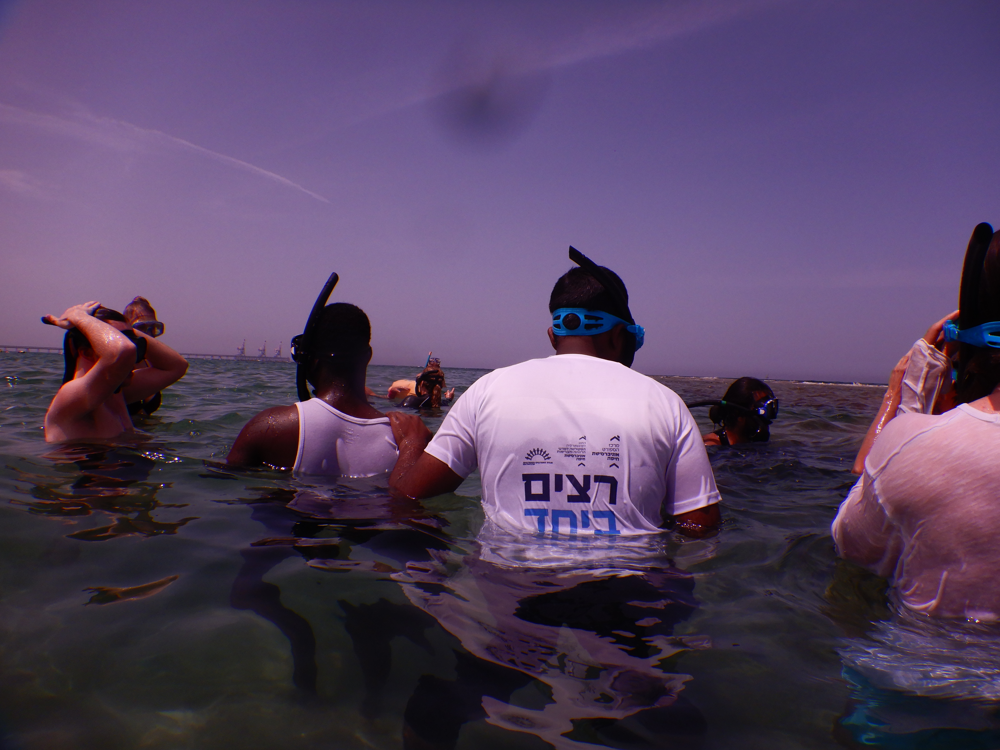
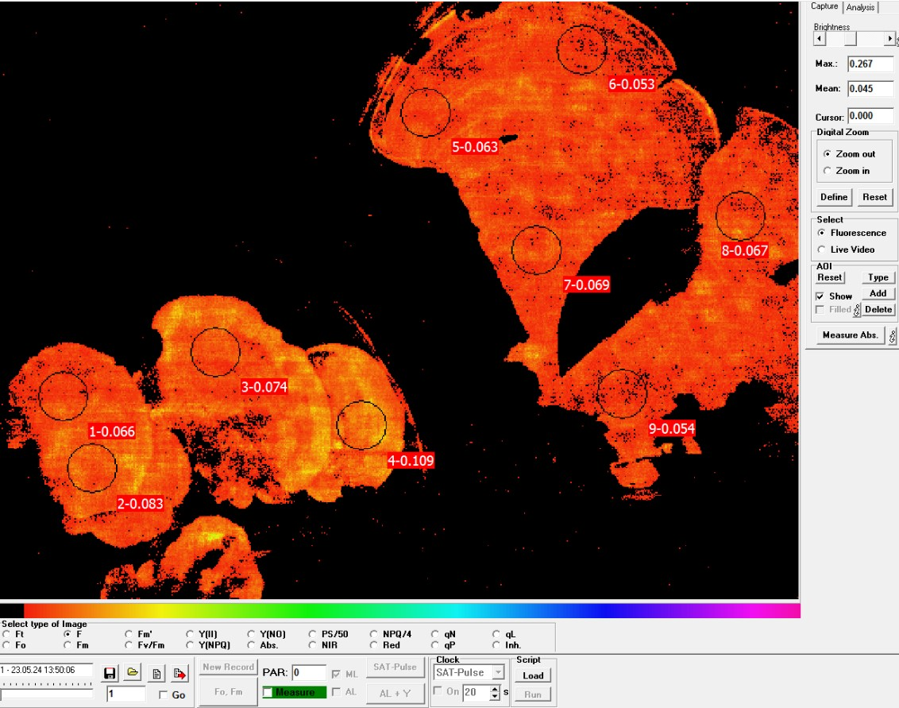

# Field Trip Report: Research Methods in Marine Biology

## Overview

we hade an insightful field trip to the sea, focusing on practical research methods. We began our journey at the Sdot Yam station, where we packed our equipment and walked to the nearby beach.

## Activities

### Walking Tour on the Rocky Shore

We started our day with a walking tour along the rocky shore, where we observed and identified various types of seaweed. This initial exploration allowed us to familiarize ourselves with the different species present in the area.

### Snorkeling

Next, we took to the water with our snorkeling gear. This underwater adventure provided a unique perspective on the seaweed, allowing us to see how different species thrive below the surface.

### Distribution Measurement

For the final part of our field trip, we returned to the rocky shore to conduct a more detailed study. Using a meter and matrix, we measured the distribution of various seaweed types across the rocky shore. This involved noting the locations and abundance of each species in the designated area.

### Photokinetic Capacity Analysis

Additionally, we collected seaweed samples from areas with varying light conditions—high light and low light environments. These samples were then analyzed to assess their photokinetic capacity, helping us understand how different light conditions affect seaweed growth and function.

## Conclusion

This field trip provided us with valuable hands-on experience in marine biology research methods. From observing seaweed in its natural habitat to conducting detailed scientific measurements, each activity contributed to our understanding of marine ecosystems and the techniques used to study them.