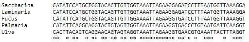
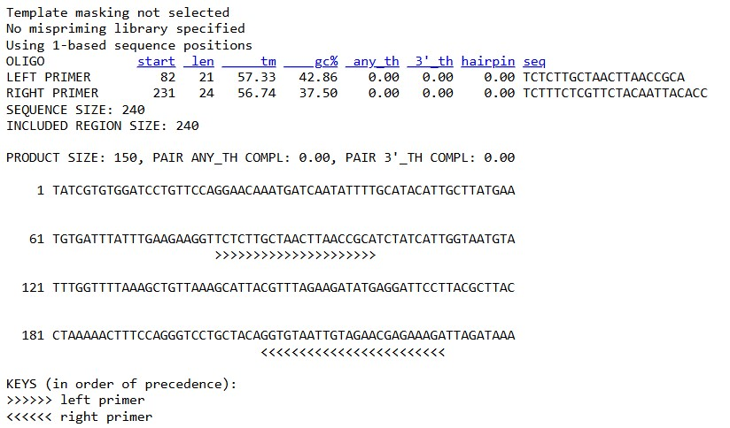
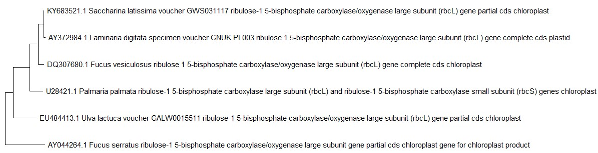

# Lab Protocol: Primer Design and Phylogenetic Tree Construction

## Introduction
This protocol outlines the steps to design primers and construct a phylogenetic tree. We will use commonly targeted genetic regions, retrieve sequences, perform sequence alignment, identify conserved regions for primer design, and ensure primer specificity. Finally, we will construct a phylogenetic tree using MEGA software.

## Materials and Tools
- GenBank or similar database for sequence retrieval
- ClustalW or MUSCLE for sequence alignment
- Primer3 or Primer-BLAST for primer design
- BLASTn for primer specificity check
- MEGA software for phylogenetic tree construction

## Step 1: Identify a Suitable Genetic Region for Amplification
Common targets for algal species identification include:
- Ribosomal DNA regions (e.g., 18S rRNA, ITS1, ITS2)
- Chloroplast genes (e.g., rbcL, tufA)
- Mitochondrial genes (e.g., COX)

Select the target sequence according to your purpose.

in my research proposal i want to study the affects of clement chang on Fucus vesiculosus, so my Genetic Region of inters will be its rbcL gene

## Step 2: Retrieve Sequences
1. Obtain sequences of the chosen region from a database like [NCBI GenBank](https://www.ncbi.nlm.nih.gov/). search in the Nucleotide option

    \>Fucus vesiculosus rbcL

    ATGCCTGAGAACGTACAGGAAAGAACTCGATTAAAAAGTGAGCGTTATGAATCTGGTGTAATCCCATATG
    CTAAAATGGGATATTGGGATGCAGATTACAACGTTAAAGATACTGATATTCTAGCTCTATTTCGTATAAC
    TCCACAACCAGGTGTAGATCCTGTGGAAGCTGCTGCTGCTGTTGCTGGTGAATCTTCAACTGCAACGTGG
    ACAGTAGTATGGACAGATTTACTAACTGCTTGTGACATCTACCGAGCGAAAGCATATCGTGTGGATCCTG
    TTCCAGGAACAAATGATCAATATTTTGCATACATTGCTTATGAATGTGATTTATTTGAAGAAGGTTCTCT
    TGCTAACTTAACCGCATCTATCATTGGTAATGTATTTGGTTTTAAAGCTGTTAAAGCATTACGTTTAGAA
    GATATGAGGATTCCTTACGCTTACCTAAAAACTTTCCAGGGTCCTGCTACAGGTGTAATTGTAGAACGAG
    AAAGATTAGATAAATTTGGACGTCCTTTATTAGGAGCTACTGTAAAACCTAAATTAGGTCTTTCAGGTAA
    AAACTATGGGCGTGTTGTTTATGAAGGTTTAACAGGTGGTCTTGATTTTCTTAAAGATGATGAAAATATT
    AATTCACAACCTTTCATGCGTTGGAAAGAACGTTTCTTATATTGTATGGAAGGTGTTAACCGTGCTGCTG
    CTGCAACTGGTGAAGTTAAAGGTTCTTATCTTAATGTTACCGCAGCAACAATGGAAAATATGTATGAACG
    TGCTGAATACTCTCATGCTATCGGTAGTGTAATTTGTATGATTGATTTAGTTGTTGGTTATACAGCAATT
    CAAAGTATGGCTATTTGGGCACGAAAAGCTGAAATGATTTTGCATTTACATCGTGCAGGAAATTCTACAT
    ATGCCCGTCAAAAAAACCATGGTATTAATTTCCGAGTTATTTGTAAATGGATGCGTATGTGTGGTGTAGA
    TCATATTCATGCTGGTACAGTTGTTGGAAAATTAGAAGGTGATCCTTTAATGGTTAAAGGTTTCTATAAC
    ACACTATTATTAACAGAGCTAAAAATTAATTTAGCAGAAGGTTTGTTCTTCGATATGGATTGGGCATCTC
    TTAGAAAATGTGTTCCTGTAGCTTCTGGTGGTATTCATTGTGGTCAAATGCATCAACTTCTTTACTATTT
    AGGTGATGATGTAGTTCTACAATTTGGTGGTGGTACAATCGGTCACCCTGATGGTATACAAGCAGGCGCT
    ACAGCGAATCGTGTTGCGTTAGAAGCTATGGTTTTAGCTCGTAATGAAGGTCGTGATTATGTTGGTGAAG
    GTCCTGAAATTTTACGTACAGCTGCTAGTACTTGTGGACCATTAAAAGCAGCTTTAGATTTATGGAAAGA
    TATTACTTTTGAATATACTTCAACAGATACACCTGATTTCACTGAAGTGGCAACTGAAAGTAACTAA

2. Retrieve sequences for several species that are closely related to the target species.

    we will retrieve sequences from the four most abundant seaweed species In various North Sea aquatic environments: Ulva lactuca, Saccharina latissima, Laminaria digitata, Palmaria palmata and Fucus serratus

    \>Ulva lactuc arbcL

    GCTGGTGTAAAAGATTCCCGTTTAACTTATTACACGCCTGATTATCAAGTAAAAGATACTGATATTTTAG
    CAGCGTTTCGTATGACTCCTCAACCAGGAGTACCAGCAGAAGAAGCAGGTGCAGCTGTTGCTGCTGAATC
    ATCAACAGGTACTTGGACAACTGTATGGACTGATGGTTTAACATCGTTAGATCGTTATAAAGGTCGTTGT
    TACGATATTGAACCATTAGGAGAAGACGATCAATATATCGCTTATATTGCTTATCCTTTAGACTTATTTG
    AAGAAGGATCAGTTACAAACTTATTTACTTCAATTGTAGGTAACGTTTTTGGTTTTAAAGCTTTACGTGC
    TTTACGTTTAGAAGATTTACGTATTCCACCAGCTTATGTTAAAACATTCCAAGGTCCACCTCATGGTATC
    CAAGTTGAACGTGATAAATTAAACAAATACGGTCGTGGTTTATTAGGTTGTACAATTAAACCAAAATTAG
    GTCTTTCAGCTAAAAACTATGGACGTGCTGTTTATGAATGTTTACGAGGCGGTCTTGATTTTACAAAAGA
    TGATGAAAACGTAAACTCACAACCTTTCATGCGTTGGCGTGATCGTTTCTTATTTGTTGCTGAAGCAATT
    TATAAATCTCAATCTGAAACTGGTGAGGTGAAAGGACATTACTTAAATGCAACAGCAGGTACATGTGAAG
    AAATGATGGAACGTGGTCAATTTGCTAAAGATTTAGGTGTTCCAATTGTTATGCATGACTATATTACTGG
    TGGTTTTACAGCTAACACTTCATTATCTCGTTTCTGTCGTGCTAGTGGATTATTATTACATATTCACCGT
    GCTATGCACGCTGTTATTGATCGTCAACGTAATCACGGTATTCACTTCCGAGTATTAGCGAAAATTTTAC
    GTATGTCAGGTGGTGACCACTTACACTCAGGAACAGTAGTAGGTAAATTAGAAGGTGAACGTGAAATTAC
    TTTAGGTTTCGTTGACTTAATGCGTGATGACTACATTGAAAAAGATCGTAGTCGTGGTATTTACTTTACT
    CAAGATTGGGTTAGTTTACCTGGTACAATGCCTGTAGCGTCAGGTGGTATTCACGTGTGGCACATGCCTG
    CATTAGTTGAAATCTTTGGTGATGATGCATGTTTACAATTCGGTGGTGGTACATTAGGACACCCTTGGGG
    TAACGCTCCAGGAGCCGCTGCAAACCGTGTAGCTTTAGAAGCTTGTACACAAGCCCGAAACGAAGGGCGT
    GATTTAGCGTCTGAAGGCGGTGATGTAATTCGTGCTGCTT

    \>Saccharina latissima rbcL

    TGGTGTAATTCCGTATGCCAAAATGGGATATTGGGATGCTGATTATAACGTTAAAGACACTGATATTCTA
    GCTCTATTCCGTATAACTCCACAACCAGGCGTAGATCCCGTAGAAGCTGCCGCTGCTGTTGCGGGTGAAT
    CTTCTACTGCAACATGGACGGTAGTTTGGACAGACTTATTAACTGCTTGCGATATCTATAGAGCAAAAGC
    ATATAGAGTAGATCCAGTACCTGGAACAAGCGACCAATACTTTGCATATGTTGCTTATGAATGTGATTTA
    TTTGAGGAAGGTTCTCTTGCAAACTTAACAGCTTCTATTATTGGTAACGTTTTCGGTTTTAAAGCCGTTA
    AAGCTTTACGTCTAGAAGACATGAGAATTCCTTTTGCTTACTTAAAAACTTTCCAAGGTCCAGCTACTGG
    TGTCGTTGTGGAAAGAGAAAGATTAGACAAATTTGGTCGTCCTTTCTTAGGTGCTACTGTAAAACCTAAA
    TTAGGTCTTTCAGGTAAAAACTACGGACGTGTAGTTTATGAAGGTTTAACTGGTGGTCTTGATTTCCTTA
    AGGATGATGAGAACATTAACTCACAACCATTCATGCGTTGGAAAGAACGTTTCTTATACTGTATGGAAGG
    TGTTAACCGTGCCGCTGCTGCAACAGGTGAAGTTAAAGGTTCTTACCTTAACATTACTGCTGCAACAATG
    GAACAAATGTATGAACGTGCAGAGTACGCTCATTCAATTGGTACTGTTATTGTAATGATCGATTTAGTTA
    TCGGTTATACTGCTATTCAAACTATGGCTATCTGGGCACGAAAAGCTGAAATGATTTTACATTTACATCG
    TGCAGGTAATTCTACTTATGCTCGTCAAAAAAACCATGGTATTAACTTCCGAGTTATCTGTAAATGGATG
    CGTATGTGTGGTGTAGACCATATCCATGCTGGTACAGTTGTTGGTAAATTAGAAGGAGATCCTTTAATGG
    TTAAAGGATTCTACAACACTTTATTATTAACTCAACTTAAAATCAATTTACCTGAAGGTTTATTCTTCGA
    CATGGATTGGGCATCTTTAAGAAAATGTGTTCCAGTAGCTTCTGGTGGAATCCATTGTGGTCAAATGCAC
    CAACTTCTTTACTATTTAGGTGACGATGTGGTTCTACA

    \>Laminaria digitata rbcL

    ATGCCTGAGAATGTACAGGAAAGAACTCGGTTAAAAAGTGAGCGTTACGAATCAGGTGTAATTCCGTATG
    CCAAAATGGGATACTGGGATGCTGATTATAACGTTAAAGACACTGATATTCTAGCTCTATTCCGTATAAC
    TCCACAACCAGGCGTAGATCCCGTAGAAGCTGCCGCTGCTGTTGCGGGTGAATCTTCTACTGCAACATGG
    ACGGTAGTTTGGACAGACTTATTAACTGCTTGTGATATCTACAGAGCAAAAGCATATAGAGTAGATCCAG
    TACCTGGAACAAGCGACCAATTCTTTGCATATGTCGCTTATGAATGTGATTTATTTGAGGAAGGTTCTCT
    TGCGAACTTAACAGCCTCTATTATTGGTAACGTTTTCGGTTTTAAAGCTGTTAAAGCTTTACGTCTAGAA
    GACATGAGAATTCCTTTTGCTTACTTAAAAACTTTCCAAGGCCCAGCAACTGGTGTTATTGTGGAAAGAG
    AAAGATTAGACAAATTTGGTCGTCCTTTCTTAGGTGCTACTGTAAAACCTAAATTAGGTCTTTCAGGTAA
    AAACTACGGACGTGTAGTTTATGAAGGGTTATGTGGTGGTCTTGATTTCCTTAAGGATGATGAGAACATT
    AACTCACAACCATTCATGCGTTGGAAAGAACGTTTCTTATACTGTATGGAAGGTGTTAACCGTGCCGCTG
    CTGCAACAGGTGAAGTTAAAGGTTCTTACCTTAACGTTACTGCTGCAACAATGGAACAAATCTATGAACG
    TGCAGAGTACGCTTATTCAATTGGTACCGTTATTGTAATGGTCGATTTAGTTATCGGTTATACTGCTATT
    CAAACTATGGCTATCTGGGCAAGAAAAGCTGATATGATTTTACATTTACATCGTGCAGGTAATTCTACTT
    ATGCTCGTCAAAAAAACCATGGTATCAACTTCCGAGTTATCTGTAAATGGATGCGTATGTGTGGTGTAGA
    CCATATCCATGCTGGTACAGTTGTTGGTAAATTAGAAGGAGATCCTTTAATGGTTAAAGGATTCTACAAT
    ACTTTATTATTAACTCAACTTAAAATTAATCTACCTGAAGGTTTATTCTTCGACATGGATTGGGCATCTC
    TTAGAAAATGTGTTCCAGTAGCTTCTGGTGGAATCCATTGTGGTCAAATGCACCAACTTCTTTACTATTT
    AGGTGACGATGTGGTTCTACAATTTGGTGGTGGTACTATTGGTCACCCTGATGGTATTCAATCCGGTGCG
    ACAGCAAACCGTGTTGCTCTAGAATCTATGGTTCTAGCTCGTAATGAAGGTCGTGACTACGTTGGAGAAG
    GTCCTGAAATCTTACGTAAGGCAGCATCTACTTGTGGTCCTTTAAAAGCAGCTTTAGATTTATGGAAAGA
    TATTACTTTCGATTACACTTCAACAGATACACCTGATTTCGTTGAAGTTGCAACTGAAAGCAAATAG

    \>Palmaria palmata rbcL

    GGTATAAGTTAGTCTTTATATGATTATCAACTATTAGTCTTTAAAGACAATTAAGATAGAAACCTAAGAA
    ACTGCCTTAAATTCAAGGAGGAATACATGTCTCAATCCGTAGAACAACGGACAAGGATCAAAAACGAACG
    TTATGAGTCTGGAGTAATTCCATATGCTAAAATGGGATATTGGGATCCTGAACACGTAATTTTAGAAACT
    GATGTATTAGCTTTATTTCGTGTTACACCTCAACCAGGTGTAGATCCAATCGAAGCTTCTGCTGCAATTG
    CTGGTGAATCTTCAACAGCAACTTGGACCGTTGTATGGACAGATCTATTAACAGCTTGCGACTTATACAG
    AGCAAAATGTTATAAAGTAGATGCAGTACCAAATACAAGTGATCAGTACTTCGCATACATTGCATATGAT
    ATTGATTTATTTGAAGAAGGATCAATTGCAAACTTAACTGCTTCAATTATTGGTAACGTATTCGGATTTA
    AAGCTGTAAAAGCTTTACGTCTTGAAGACATGCGTTTACCAGTTGCATACCTTAAAACTTTCCAAGGTCC
    TGCAACAGGAACAGTTGTAGAACGTGAACGTATGGATAAGTTTGGTCGTCCTTTTCTAGGTGCAACTGTA
    AAGCCTAAGCTAGGTCTATCTGGTAAGAACTACGGGCGAGTAGTGTATGAAGGTCTAAAAGGTGGTCTGG
    ACTTCCTTAAAGATGATGAAAATATTAATTCTCAACCATTCATGCGTTATAGCGAAAGATACCTTTACTC
    TATGGAAGGTGTTAACCGTGCTCAAGCTGCTGCTGGTGAAATTAAAGGACATTATCTTAATGTAACAGCT
    GCTACAATGGAAAACATGTACGAAAGAGCTGAGTTTGCTCAACAACTAGGGAGTGTTATTTGCATGATTG
    ACCTTGTAATTGGTTATTCAGCTATTCAAAGTATGGCAATCTGGGCTCGTAAGACAGATATGATTTTACA
    TTTACACAGAGCTGGTAATTCAACATACTCTCGTCAAAAAATTCATGGTATGAACTTCCGAGTTATTTGC
    AAGTGGATGCGTATGGCTGGAGTTGATCATATTCACGCAGGTACTGTAGTTGGTAAATTAGAAGGTGACC
    CTGTAATGATTCAAGGTTTCTACAATACTTTACTTGAGAGTCATCTTGAAGCGAACTTACCTCAAGGTAT
    CTTCTTCGAACAAGATTGGGCTTCACTAAGAAAATGTACTCCTGTTGCTTCTGGTGGTATTCATTGTGGA
    CAAATGCATCAACTGTTAGACTATCTTGGAGACGATGTAGTTCTTCAGTTTGGTGGTGGTACAATTGGTC
    ACCCTGATGGTATCCAAGCCGGTGCAACTGCAAATCGTGTAGCTTTAGAGAGCATGGTAATTGCAAGAAA
    TGAAGGACGCGACTTTGTTGCTGAAGGTCCTCAAATTTTGAGAGATGCAGCAAAAACTTGTGGACCTCTA
    CAAACAGCTTTAGATTTATGGAAAGATATTAGTTTCAACTATACCTCTACTGATACAGCTGATTTCGTTG
    AGACTCCAACAGCTAACGTTTAAATATAACTAGTCTTAAGTTTACTTCTAATTAAATTAGAAGATTAAAT
    TTTAGATTACTACTTGCCTAATCATTAAAGGAGTATAGAATAGTGAGATTAACACAAGGAGCTTTTTCCT
    TCCTGCCAGATTTGACAGATGACCAAATTTCAAAGCAAGTATCATATGCTATGGGAAAAGGTTGGTCTGT
    AAATATCGAGTATACTGATGATCCACACCCACGTAATTCCTACTGGGAACTGTGGGGTCTTCCACTATTT
    GATATTCCAGATGCACCTACTGTAATGTATGAAATTTCTAGTTGTCGTAAAGCACATCCAGGAGTGTATA
    TCAAAGTAAACGCTTTTGATAATACTAGAGGAGTTGAAAGTTGTTCTTTATCTTTCATCATCAATAGACC
    TGCTTCTGAACCTGGTTTCGGACTTCTACGTACTGAAGATATTGGACGTAACCAAAAGTATGCTATTCAT
    AGTTATGCTACAGAAAAACCTGAAGGCTCTCGTTACTAGAGCATTAAGTAATATTTATTCATAACTTATG
    ACTAAAAAAAGAAATTATAGAAATATAATTTCTTTTATTTATTTAATATTAACTTAAAAAATAGTATGCC
    ACAAAAATTTTCAGACGATACT

## Step 3: Align Sequences
1. Use a tool like [ClustalW](https://www.genome.jp/tools-bin/clustalw) or [MUSCLE](https://www.ebi.ac.uk/jdispatcher/msa/muscle) to align the sequences.
2. This alignment helps identify conserved and variable regions. conserved regions will be markt with *

    [see alignment hayer](../files/molty_alingment.txt)
    

## Step 4: Identify Conserved Regions
1. Look for conserved regions within the alignment flanked (*) by variable regions.

2. These conserved regions will be the sites for primer design.

    

## Step 5: Design Primers
1. Use a primer design tool such as [Primer3](https://primer3.ut.ee/) or [Primer-BLAST](https://www.ncbi.nlm.nih.gov/tools/primer-blast/) to design primers in the conserved regions.
    
    we will use the conserved regions: TATCGTGTGGATCCTGTTCCAGGAACAAATGATCAATATTTTGCATACATTGCTTATGAATGTGATTTATTTGAAGAAGGTTCTCTTGCTAACTTAACCGCATCTATCATTGGTAATGTATTTGGTTTTAAAGCTGTTAAAGCATTACGTTTAGAAGATATGAGGATTCCTTACGCTTACCTAAAAACTTTCCAGGGTCCTGCTACAGGTGTAATTGTAGAACGAGAAAGATTAGATAAA
    witch is highly conserved in the middle of it and les conserve at the eggs
2. Consider the following criteria:
    - Primer length: 18-25 nucleotides
    - Melting temperature (Tm): 50-60°C
    - GC content: 40-60%
    - Avoid secondary structures (hairpins, dimers)
    - Ensure primers are specific to the target species

    

    the primers fit the criterias, with a  GC content around 40%, Tm in the rage of 50-60 and do not have secondary structures

## Step 6: Check Primer Specificity
1. Use a tool like [BLASTN](https://blast.ncbi.nlm.nih.gov/Blast.cgi?PROGRAM=blastn&PAGE_TYPE=BlastSearch&LINK_LOC=blasthome) to check the specificity of the designed primers against the entire database.
    will enter both primers as FASTA format
    
    \>foreds

    TCTCTTGCTAACTTAACCGCA
    
    \>bakwerds
    
    GGTGTAATTGTAGAACGAGAAAGA

2. Ensure they do not bind non-target species.
    the blast results show that the primers aline 100% to are species of interest, 

## Creating a Phylogenetic Tree Using MEGA
1. Prepare Your Sequence Data
    - Collect and format your sequences in FASTA format.

    [see FASTA file](../files/five_rbcL.fasta)

2. Align Sequences in MEGA
    - Open MEGA software.
    - Click on `Align` > `Edit/Build Alignment` > `Create a New Alignment`.
    - Copy and paste your FASTA sequences into the alignment window.
    - Perform alignment using MUSCLE.
    - Save the alignment file.

3. Construct the Phylogenetic Tree
    - Click on `Phylogeny` > `Construct/Test Maximum Likelihood Tree`.
    - Load your alignment file.
    - Follow the prompts to set tree construction parameters.
    - Generate the phylogenetic tree.

    

## Conclusion
Following this protocol, you can design specific primers for the amplification of target genetic regions in algal species and construct phylogenetic trees to study their relationships. Ensure to validate primer specificity to avoid non-target amplification.

## References
- Primer3: http://bioinfo.ut.ee/primer3-0.4.0/
- Primer-BLAST: https://www.ncbi.nlm.nih.gov/tools/primer-blast/
- BLAST: https://blast.ncbi.nlm.nih.gov/Blast.cgi
- MEGA: https://www.megasoftware.net/

